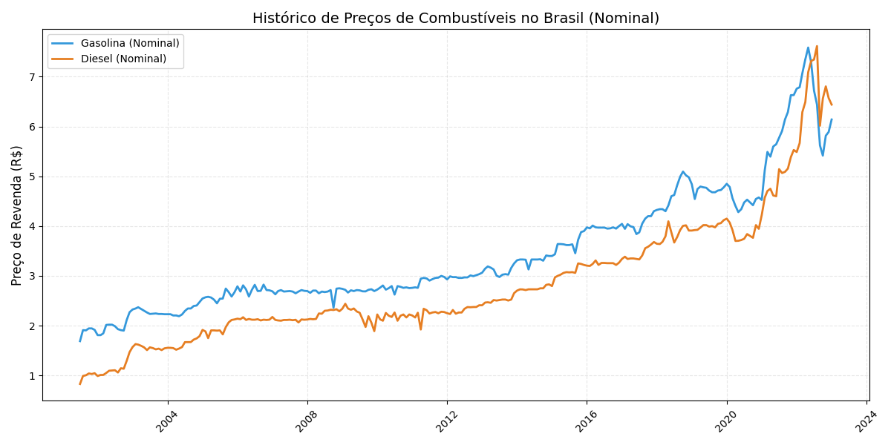
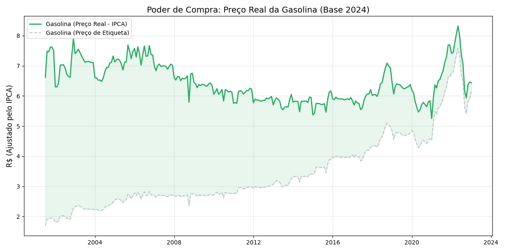
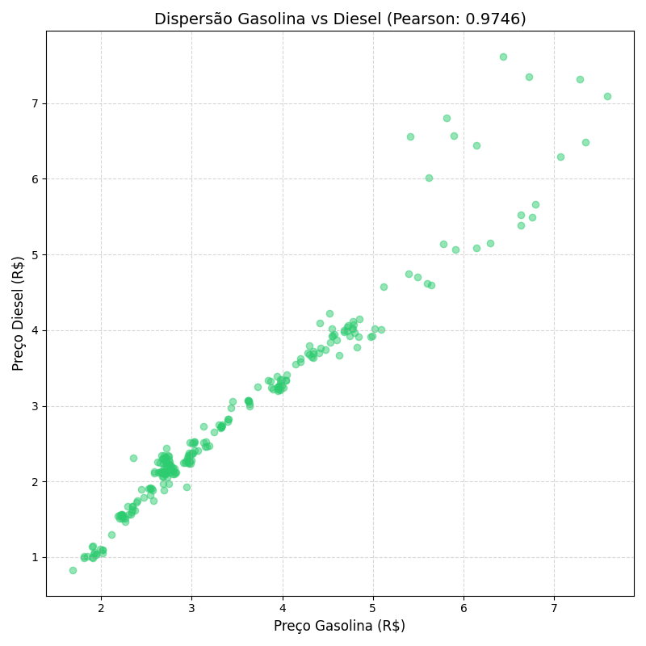

# Análise de Preços de Combustíveis no Brasil

Este projeto realiza a coleta, tratamento e análise exploratória de dados sobre os preços de combustíveis no Brasil, utilizando a biblioteca `kagglehub` para baixar os datasets diretamente do Kaggle e `matplotlib` para visualização.

## 🚀 Como Executar o Projeto

Siga os passos abaixo para configurar o ambiente e rodar a análise.

### 1. Pré-requisitos

Certifique-se de ter o **Python 3.10+** instalado em sua máquina.

### 2. Configurar o Ambiente Virtual (venv)

Recomenda-se o uso de um ambiente virtual para isolar as dependências do projeto.

No terminal, na raiz do projeto, execute:

```bash
# Criar o ambiente virtual
python -m venv .venv
```

Agora, ative o ambiente virtual:

- **Linux/macOS:**
  ```bash
  source .venv/bin/activate
  ```
- **Windows (PowerShell):**
  ```powershell
  .\.venv\Scripts\Activate.ps1
  ```

### 3. Instalar Dependências

Com o ambiente virtual ativo, instale as bibliotecas necessárias:

```bash
pip install -r requirements.txt
```

### 4. Executar a Análise

Para rodar o script principal:

```bash
python main.py
```

## 📊 Funcionalidades e Análises

O script `main.py` está estruturado em funções para garantir a organização do fluxo de dados:

1.  **Carga de Dados:** Download automático do dataset `combustiveis-brasil.csv` via `kagglehub`.
2.  **Tratamento:** Limpeza de nulos, normalização de colunas e criação de séries temporais.
3.  **Análise Estatística:**
    *   Cálculo da média de preços de revenda (Mín/Máx).
    *   Cálculo de variação nominal e deflacionada.
    *   Análise de correlação entre ativos.

## 📈 Visualização de Resultados

Abaixo, os principais insights gerados pela ferramenta:

### 1. Evolução Histórica (Nominal)

> Trajetória dos preços médios de revenda de gasolina e diesel ao longo do tempo.

### 2. Poder de Compra (Ajustado pelo IPCA)

> Comparação entre o preço de "etiqueta" e o preço real ajustado pela inflação (Base 2024), evidenciando o impacto inflacionário.

### 3. Correlação Gasolina vs Diesel

> Análise de dispersão demonstrando a forte dependência linear entre os dois combustíveis.

## 📂 Dados Utilizados

O projeto consome o dataset [fidelissauro/combustiveis-brasil](https://www.kaggle.com/datasets/fidelissauro/combustiveis-brasil) via `kagglehub`.

---
